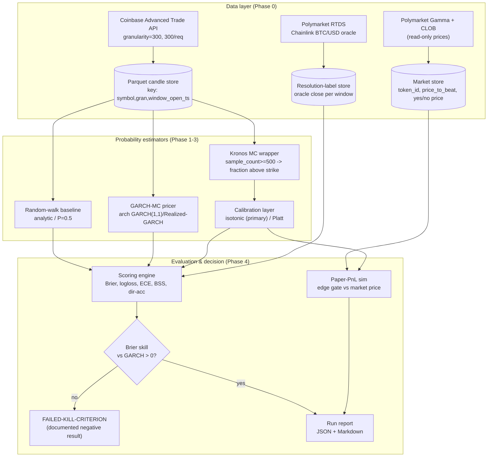
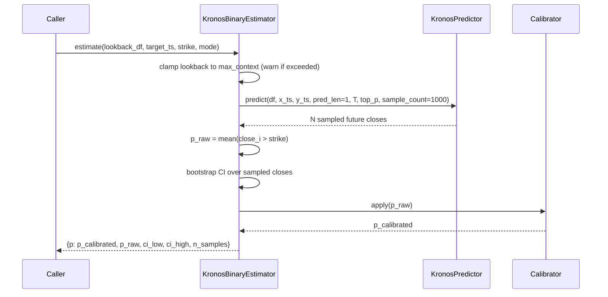

# design.md — Strikecast

> The **how**. Architecture, tech-stack justifications, data models, API contracts, decided tradeoffs, folder layout, and data flow. See [`STEERING.md`](./STEERING.md), [`requirements.md`](./requirements.md), [`QUALITY.md`](./QUALITY.md).

---

## 1. System architecture



### Probability-estimation sequence (the core path)



---

## 2. Tech-stack decisions (with justification from research)

| Layer | Choice | Why (research-grounded) |
|-------|--------|--------------------------|
| Language | **Python 3.10+** | Kronos requires 3.10+ ([repo getting-started](https://github.com/shiyu-coder/Kronos)); the entire ML/stats stack is Python-native. |
| Model | **Kronos-small → base** (fork) | Small = 24.7M params for fast iteration; base = 102.3M if small shows promise. Large is **not** open-source. Context limit 512 (small/base) drives lookback design. |
| Inference wrapper | **`KronosPredictor`** | Upstream class already handles normalization, sampling (`T`, `top_p`, `sample_count`), and `predict_batch`. We wrap, not reimplement. |
| Exchange data | **Coinbase Advanced Trade API via `ccxt`** | US-legal (Binance.com is blocked for the developer); supports `granularity=300`; `ccxt` gives a venue-agnostic interface so Kraken can be swapped (FR-004). Public candle reads need no order permissions. |
| Bulk candle pull | **custom paginator** (pattern from `cbhist`) | Coinbase caps at 300 candles/request; binary-search for series start then iterate, as `cbhist` does, to avoid wasted calls. |
| Volatility baseline | **`arch` package** (GARCH/Realized-GARCH) | Standard, battle-tested; Realized-GARCH shown best out-of-sample for crypto vol ([MDPI 2023](https://www.mdpi.com/2227-9091/11/12/211)). `arch_model(...)` API is the reference implementation. |
| Calibration | **scikit-learn** `IsotonicRegression` + `CalibratedClassifierCV(method='sigmoid')` | Isotonic is more flexible (any monotonic distortion) but can overfit small data; Platt is the sigmoid fallback. Calibrate on a **separate** validation split ([trainindata](https://www.blog.trainindata.com/probability-calibration-in-machine-learning/)). |
| Reliability diagrams | **CORP / PAV isotonic** approach | Classical equal-width binning is unstable; CORP (PAV-based) gives consistent, reproducible reliability diagrams ([PNAS 2021](https://www.pnas.org/doi/10.1073/pnas.2016191118)). |
| Splitting / CV | **purged + embargoed walk-forward** | Labels depend on a future bar → conventional k-fold leaks. Purged CV (López de Prado) removes overlap; embargo removes serial-correlation bleed ([Wikipedia](https://en.wikipedia.org/wiki/Purged_cross-validation)). |
| Polymarket reads | **`py-clob-client` (read methods only)** + Gamma REST | Official client; we use only market/price reads. Gamma `events?slug=` returns Up/Down token IDs + prices in one call ([gist](https://gist.github.com/Archetapp/7680adabc48f812a561ca79d73cbac69)). |
| Storage | **Parquet (pyarrow) + DuckDB** for queries | Columnar, fast, local, no server. DuckDB queries Parquet directly for evaluation joins. |
| Config | **Pydantic + YAML** | Single typed config object; validates paths/hyperparams; matches the upstream `finetune/config.py` philosophy. |
| Env | **uv or conda, locked** | Reproducibility (NFR-003); pin Kronos commit + all deps. |

---

## 3. Data models / schemas

### `candles` (Parquet)
| column | type | notes |
|--------|------|-------|
| `symbol` | str | `BTC-USD` |
| `granularity` | int | seconds, `300` |
| `window_open_ts` | int64 | Unix epoch, divisible by 300 (FR-007) |
| `open,high,low,close` | float64 | Coinbase candle OHLC |
| `volume` | float64 | base volume |
| `amount` | float64 | optional (quote turnover); 0 if absent |
| `source` | str | `coinbase` |
| _PK_ | | `(symbol, granularity, window_open_ts)` |

### `pm_markets` (Parquet)
| column | type | notes |
|--------|------|-------|
| `window_open_ts` | int64 | aligned to 300-grid |
| `condition_id` | str | Polymarket market id |
| `token_id_up`, `token_id_down` | str | CLOB token ids |
| `price_to_beat` | float64 | strike = Chainlink price at window open |
| `price_up`, `price_down` | float64 | implied probs (0–1), midpoint of CLOB |
| `captured_ts` | int64 | when we read it (for snapshotting drift) |

### `resolution_labels` (Parquet)
| column | type | notes |
|--------|------|-------|
| `window_open_ts` | int64 | |
| `oracle_close` | float64 | Chainlink BTC/USD at window close |
| `coinbase_close` | float64 | for basis-risk analysis (§6) |
| `outcome_up` | bool | `oracle_close > price_to_beat` |

### `predictions` (run output, Parquet)
| column | type | notes |
|--------|------|-------|
| `run_id` | str | git commit + timestamp |
| `window_open_ts` | int64 | |
| `estimator` | str | `randomwalk` \| `garch_mc` \| `kronos_raw` \| `kronos_cal` |
| `strike` | float64 | |
| `p` | float64 | probability above strike |
| `p_ci_low`, `p_ci_high` | float64 | bootstrap CI (Kronos only) |
| `n_samples` | int | |
| `label` | bool | from `resolution_labels` |
| `moneyness` | float64 | `(strike − open)/open` |

---

## 4. Data flow & integration points

1. **Coinbase → candle store.** Paginated pull (300/req, ≤30 req/s authed), aligned to the 300s grid, deduped on PK, gaps logged.
2. **Polymarket Gamma/CLOB → market store.** For each 300s window, resolve the active Up/Down market by computing the window id (timestamps divisible by 300; the bot *computes* which market is active rather than searching). Snapshot Up/Down midpoint prices.
3. **Polymarket RTDS (`crypto_prices_chainlink`, btc/usd filter) → label store.** Capture the oracle price at/after each window boundary — this is the value Polymarket resolves against, and it matches "Price To Beat" at the boundary.
4. **Estimators → predictions.** Each estimator consumes the candle store for its lookback and emits a probability per window.
5. **Scoring join.** DuckDB joins `predictions` ⋈ `resolution_labels` on `window_open_ts`; paper-PnL additionally joins `pm_markets` for the market price.

> **Integration boundary (legal):** the Polymarket client is instantiated in a **read-only** module with no signer/wallet. NFR-001 is enforced by a CI check that fails if `py-clob-client` order/signing symbols are imported anywhere.

---

## 5. API / interface contracts (internal Python)

```python
# candle source (FR-001, FR-004)
class CandleSource(Protocol):
    def fetch(self, symbol: str, granularity: int,
              start: int, end: int) -> pd.DataFrame: ...   # OHLCV+amount, grid-aligned

# core estimator (FR-010..FR-013)
class KronosBinaryEstimator:
    def __init__(self, predictor: KronosPredictor, calibrator: Calibrator | None,
                 sample_count: int = 1000, T: float = 1.0, top_p: float = 0.9): ...
    def estimate(self, lookback_df: pd.DataFrame, x_ts: pd.Series,
                 target_ts: pd.Timestamp, strike: float,
                 mode: Literal["fixed_strike", "up_or_down"]) -> ProbResult: ...

@dataclass
class ProbResult:
    p: float            # calibrated
    p_raw: float        # before calibration
    ci_low: float
    ci_high: float
    n_samples: int

# baselines (FR-030, FR-031) — same return contract
class RandomWalkEstimator:  def estimate(...) -> ProbResult: ...
class GarchMonteCarloEstimator: def estimate(...) -> ProbResult: ...

# calibration (FR-020, FR-021)
class Calibrator:
    def fit(self, p_raw: np.ndarray, outcomes: np.ndarray) -> None: ...  # on validation split only
    def apply(self, p_raw: float | np.ndarray) -> float | np.ndarray: ...

# evaluation (FR-041, FR-044)
def score(predictions: pd.DataFrame, labels: pd.DataFrame) -> ScoreReport: ...
#   -> per estimator/moneyness: brier, logloss, ece, dir_acc, brier_skill_vs_garch, kill_flag
```

### External endpoints consumed (read-only)

| Service | Endpoint | Use |
|---------|----------|-----|
| Coinbase | `GET /api/v3/brokerage/market/products/{id}/candles?granularity=300&start&end` | historical candles (≤300/req) |
| Polymarket Gamma | `GET gamma-api.polymarket.com/events?slug=...` | resolve Up/Down token ids + prices |
| Polymarket CLOB | `GET /price` (token, side), `GET /midpoint` | implied probability |
| Polymarket RTDS | WSS `crypto_prices_chainlink` (btc/usd) | resolution oracle price at boundary |

---

## 6. Key tradeoffs already decided

1. **Coinbase for modeling, Chainlink for labels (the oracle gap).** The model trains/infers on Coinbase candles, but Polymarket resolves on Chainlink. Rather than force a single source, we accept the basis and *measure* it: `resolution_labels` stores both `oracle_close` and `coinbase_close`. Model-internal scoring uses Coinbase (consistent with training); Polymarket paper-PnL uses Chainlink (consistent with how the bet actually resolves). The basis distribution is reported so we know how much edge it eats.
2. **Monte-Carlo aggregation over a classification head.** We could bolt a binary classifier onto Kronos embeddings. We don't, for v1: the MC-over-sampled-paths approach reuses Kronos exactly as designed (probabilistic via `sample_count`), needs no architecture surgery, and naturally handles arbitrary strikes. A learned head is a P2 experiment if MC underperforms.
3. **`sample_count=1000` default.** Higher = lower MC variance but linear cost. 1000 keeps the CI on `p` tight enough (±~1.5pp) for near-money decisions while staying within NFR-005's 5s budget on the target GPU. Tunable.
4. **Kronos-small first.** 24.7M params iterates fast; only escalate to base (102.3M) if small clears the kill criterion or shows a promising trend. Avoids burning the compute budget early.
5. **Baseline before model.** GARCH-MC and the scoring harness are built in Phase 1, before Kronos is even wrapped, so the scoreboard exists before the contestant and there's zero temptation to grade Kronos on a friendlier metric.
6. **Read-only Polymarket, hard-isolated.** Trading is impossible by construction, not by discipline — the order/signing surface of `py-clob-client` is never imported (CI-enforced).
7. **Fork + adapter, minimal diff.** Kronos edits live behind an adapter; upstream diff kept ≤400 lines (NFR-009) so new checkpoints/longer-context releases rebase cleanly.

---

## 7. Folder structure

```
strikecast/
├── README.md
├── pyproject.toml              # pinned deps incl. exact Kronos commit
├── config/
│   └── default.yaml            # Pydantic-validated: paths, hyperparams, seed
├── strikecast/
│   ├── data/
│   │   ├── candle_source.py    # CandleSource Protocol + CoinbaseSource (ccxt)
│   │   ├── paginator.py        # 300/req binary-search pull (cbhist pattern)
│   │   ├── polymarket_read.py  # READ-ONLY Gamma/CLOB + RTDS oracle capture
│   │   └── store.py            # Parquet/DuckDB read+write, grid alignment, gap report
│   ├── estimators/
│   │   ├── base.py             # ProbResult, Estimator protocol
│   │   ├── random_walk.py      # FR-030
│   │   ├── garch_mc.py         # FR-031 (arch)
│   │   └── kronos_binary.py    # FR-010..015 (wraps KronosPredictor)
│   ├── calibration/
│   │   ├── calibrator.py       # isotonic primary / Platt fallback
│   │   └── reliability.py      # CORP/PAV reliability diagram + ECE
│   ├── eval/
│   │   ├── splits.py           # purged + embargoed walk-forward (FR-040)
│   │   ├── scoring.py          # Brier/logloss/ECE/BSS/dir-acc + kill flag
│   │   ├── paper_pnl.py        # edge-gate sim vs market price (FR-043)
│   │   └── report.py           # JSON + Markdown run report (FR-045)
│   └── cli.py                  # single entrypoint: run full experiment (FR-060)
├── kronos_fork/                # git submodule -> our fork of shiyu-coder/Kronos
│   └── finetune/config.py      # BTC 5-min fine-tune config (FR-050)
├── tests/
│   ├── test_no_leakage.py      # NFR-002 shuffle-future test
│   ├── test_no_order_path.py   # NFR-001 import-guard
│   └── test_reproducibility.py # NFR-003
└── reports/                    # generated, gitignored
```

---

### Sources
- Kronos predictor/sampling/context, fine-tune pipeline, model zoo: <https://github.com/shiyu-coder/Kronos>
- Coinbase candles (granularity, 300/req): <https://docs.cdp.coinbase.com/api-reference/exchange-api/rest-api/products/get-product-candles>; bulk-pull pattern: <https://pypi.org/project/cbhist>
- Polymarket pricing + Up/Down window mechanics + Chainlink resolution: <https://docs.polymarket.com/api-reference/pricing/get-market-price>, <https://gist.github.com/Archetapp/7680adabc48f812a561ca79d73cbac69>, <https://pypi.org/project/polymarket-apis/>
- GARCH/Realized-GARCH crypto baseline (`arch`): <https://www.mdpi.com/2227-9091/11/12/211>
- Calibration (isotonic/Platt) + CORP reliability: <https://www.blog.trainindata.com/probability-calibration-in-machine-learning/>, <https://www.pnas.org/doi/10.1073/pnas.2016191118>
- Purged + embargoed CV: <https://en.wikipedia.org/wiki/Purged_cross-validation>
